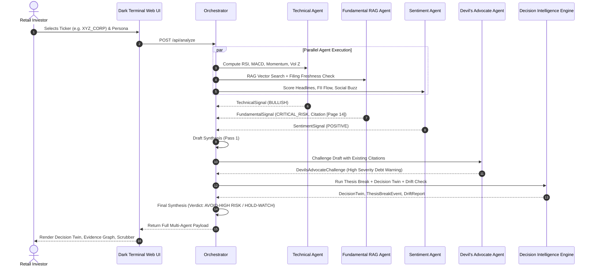

# FinIntel Decision Engine

> **Multi-Agent Autonomous Financial Intelligence System for Retail Investors**  
> *HACKVERSE 2026 — Track: Sprint 1 (Rapid Vibe Coding, PS-01)*  
> *Spec Version: 3.0 (Includes §18 Investor Decision Intelligence Engine)*

---

## 1. Executive Summary & Problem Statement

In retail options and equity markets, **89% of individual participants lose money** not due to an absolute lack of raw data feeds, but due to a structural lack of research infrastructure: unexplainable algorithmic black boxes, cognitive biases (FOMO, recency bias, momentum chasing), and an inability to reconcile conflicting signals (e.g. sharp price breakouts on companies carrying hidden regulatory balance-sheet distress).

The **FinIntel Decision Engine** converts simulated market data, regulatory SEBI filings, and behavioral user patterns into explainable, personalized, citation-grounded investment intelligence for retail investors. The system reasons about what market events mean for a *specific* user's portfolio and risk profile, justifying every step of its reasoning transparently.

> [!IMPORTANT]
> **Research & Education Prototype**: This system does not execute trades and does not provide financial guarantees. All outputs are strictly framed as `BUY CANDIDATE`, `HOLD-WATCH`, `REDUCE EXPOSURE`, or `AVOID-HIGH RISK`.

---

## 2. Four Core Differentiating Capabilities

Unlike published reference architectures (FinRobot, FINCON, P1GPT, AWS multi-agent patterns), FinIntel Decision Engine introduces four tightly integrated capabilities:

1. **Devil's Advocate Agent (§8.7, §18.6)**: An evidence-constrained adversarial pass executed between draft and final synthesis that stress-tests conclusions against existing regulatory filings and thesis assumptions — *absent in reference systems that rely on single-shot LLM prompts to reconcile conflicting signals.*
2. **Confidence Decomposition (§7.2, §9.2)**: Deconstructs opaque single-number confidence into four verifiable sub-scores: Data Freshness (25%), Agent Agreement (35%), Evidence Strength (25%), and Historical Calibration (15%) — *absent in reference systems that return uncalibrated, monolithic LLM confidence scores.*
3. **Behavioral Bias Mirror & Drift Engine (§8.5, §18.5)**: Audits the investor's own query intensity and sizing patterns (e.g. momentum chasing after sharp price spikes) to emit non-judgmental, plain-language nudges — *absent in reference architectures that treat market analysis in isolation from user behavior.*
4. **Filing Freshness & Provenance Check (§8.4, §9.4)**: Distinguishes "stale regulatory disclosures" (>12 months) from "missing evidence", degrading confidence while never withholding archived context — *absent in reference retrieval systems that treat all retrieved chunks as equally timely.*

---

## 3. System Architecture & Orchestration

```
RAW SIMULATED MARKET / FILINGS DATA
               │
               ▼
┌────────────────────────────────────────────────────────┐
│  PARALLEL SPECIALIZED AGENTS (asyncio.gather)          │
│  ├── Technical Agent (RSI, MACD, Momentum, Vol Z)      │
│  ├── Fundamental RAG Agent (ChromaDB + Citations)      │
│  └── Sentiment Agent (Headlines, FII/DII, Social)      │
└──────────────────────────┬─────────────────────────────┘
                           │
                           ▼
               Draft Synthesis (Pass 1)
                           │
                           ▼
        ┌──────────────────────────────────────┐
        │  Devil's Advocate Adversarial Pass   │
        │  (Stress-tests against citations)    │
        └──────────────────┬───────────────────┘
                           │
                           ▼
               Final Synthesis (Pass 2)
                           │
                           ▼
        ┌──────────────────────────────────────┐
        │  Investor Decision Intelligence      │
        │  ├── Decision Twin (5 Dimensions)    │
        │  ├── Thesis Break Detector           │
        │  ├── Behavioral Drift & Bias Mirror  │
        │  └── Counterfactual Simulator        │
        └──────────────────┬───────────────────┘
                           │
                           ▼
        Telemetry, Evidence Graph & Dark Terminal UI
```

### Mermaid Sequence Diagram



---

## 4. Investor Decision Intelligence Engine (§18)

- **Investment Decision Twin (§18.1)**: Evaluates 5 separate dimensions side-by-side without averaging:
  1. *Market Confidence*: Raw technical/sentiment/fundamental alignment.
  2. *Decision Fit*: Persona constraints and portfolio concentration fit.
  3. *Evidence Quality*: Filing citation density and freshness.
  4. *Thesis Health*: Health of original investment assumptions.
  5. *Behavioral Risk*: FOMO / momentum chasing indicators.
- **Thesis Break Detector (§18.2)**: Compares live filing disclosures against stored thesis assumptions (e.g. `debt_to_equity stays below 1.2`), emitting citation-backed `ThesisBreakEvent`s when breached.
- **Counterfactual Simulator (§18.3)**: Deterministically calculates Best (+25%), Base (+4%), Failure (-20%), and Thesis-Break (-45%) portfolio impact scenarios with mandatory disclaimers.
- **Evidence Provenance Graph (§18.7)**: Constructs a verifiable tree `Final Decision -> Claims -> Evidence -> Source Documents` with citation links.
- **What Changed Engine (§18.8)**: Generates prioritized diffs across sessions without hallucinations.

---

## 5. API Reference

| Method | Endpoint | Description |
|---|---|---|
| `GET` | `/` | Serves the dark-mode interactive terminal dashboard |
| `GET` | `/health` | System liveness, indexed document count, and AI mode |
| `GET` | `/api/stocks` | Available watchlist tickers (`TATAMOTORS`, `INFOSYS`, `XYZ_CORP`) |
| `GET` | `/api/personas` | Persona parameters (`conservative`, `aggressive`) |
| `GET` | `/api/demo-scenarios` | Metadata for demo scenarios (A, B, C, D) |
| `GET` | `/api/calibration` | Session-local calibration ledger summary |
| `POST` | `/api/analyze` | Main multi-agent analysis and synthesis |
| `POST` | `/api/thesis` | Create or update a stored investment thesis |
| `GET` | `/api/thesis/{ticker}` | Retrieve stored thesis and active break events |
| `GET` | `/api/decision-twin/{ticker}` | 5-dimension side-by-side Decision Twin |
| `POST` | `/api/simulate` | 4-scenario counterfactual simulation |
| `GET` | `/api/evidence-graph/{session_id}` | Node-link evidence provenance graph |
| `GET` | `/api/what-changed/{ticker}` | Prioritized diff between analysis sessions |

---

## 6. Demo Scenarios Walkthrough

| Scenario | Ticker | Persona | Expected Stance | Differentiating Highlights |
|---|---|---|---|---|
| **Scenario A** *(Aligned)* | `TATAMOTORS` | Conservative | `BUY CANDIDATE` | Technical breakout validated by JLR free cash flow and balance sheet deleveraging (`[SEBI-Filing-TATAMOTORS-Q3: Page 12]`). |
| **Scenario B** *(Conflict)* | `XYZ_CORP` | Conservative | `AVOID-HIGH RISK` | Bullish technicals & sentiment conflict with 3.85x debt in `[SEBI-Filing-XYZ-Q3: Page 14]`. Majority voting rejected. |
| **Scenario C** *(Degraded)* | `TATAMOTORS` | Any | `HOLD-WATCH` | Simulated feed outage; confidence reduced gracefully without 500 error. |
| **Scenario D** *(Lead Demo)* | `XYZ_CORP` | Aggressive | `HOLD-WATCH` | **Exercises all 4 capabilities**: Stale filing warning + `MOMENTUM_CHASING` bias nudge + Devil's Advocate debt challenge + Thesis Break trigger. |

---

## 7. Installation & Quickstart

### Prerequisites
- Python 3.11+

### 1. Clone & Install Dependencies
```bash
git clone <repo-url>
cd finintel-decision-engine
pip install -r requirements.txt
```

### 2. Configure Environment
```bash
cp .env.example .env
# Safe default is AI_MODE=mock (no API key required)
```

### 3. Run Test Suite (22/22 Passing)
```bash
pytest -v tests/test_system.py
```

### 4. Start the Application Server
```bash
python main.py
# Server starts at http://localhost:8000
```
Open `http://localhost:8000` in any modern web browser to access the Dark Terminal Dashboard.

---

## 8. Calibration Ledger & Disclaimers

> [!NOTE]
> The **Calibration Ledger** is session-local and in-memory only, designed to illustrate internal calibration on bundled demo scenarios rather than live-market predictive backtesting.

### Legal Disclaimer
This software is a research and educational prototype built for HACKVERSE 2026. It is not an algorithmic trading system, does not execute transactions, and does not provide certified investment advice.
