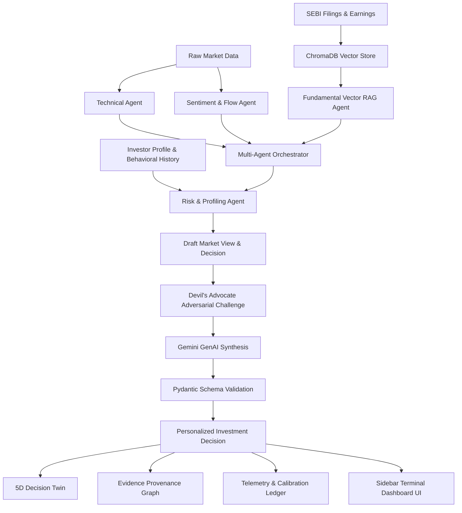

# FinIntelligence AI — Multi-Agent Autonomous Financial Intelligence System for Retail Investors

> **HACKVERSE 2026 — Problem Statement 01 (PS-01)**  
> *Vellore Institute of Technology (VIT) Chennai*

[](file:///c:/Users/GUNALAN/Downloads/finintel-decision-engine/tests/test_system.py)
[](file:///c:/Users/GUNALAN/Downloads/finintel-decision-engine)
[](file:///c:/Users/GUNALAN/Downloads/finintel-decision-engine/main.py)
[](file:///c:/Users/GUNALAN/Downloads/finintel-decision-engine/agents/fundamental_rag_agent.py)
[](file:///c:/Users/GUNALAN/Downloads/finintel-decision-engine/agents/orchestrator.py)

---

## 1. Problem Statement & Core Concept

Indian retail investors face an acute dilemma: trading apps reduce financial decision-making to binary buy/sell prompts, while institutional research is buried inside 100-page corporate filings. Retail investors routinely suffer from **cognitive bias traps** (FOMO, momentum chasing, recency bias) and misinterpret raw market momentum as personal financial suitability.

**The Fundamental Principle of FinIntelligence AI**:
$$\text{MARKET VIEW} \neq \text{PERSONALIZED ACTION}$$

A strong market signal must **never** automatically become a `BUY CANDIDATE` for every investor.

| Dimension | Market View | Investor Decision Fit |
| :--- | :--- | :--- |
| **Input Signals** | Technical Momentum, Sentiment, Balance Sheet Health | Risk Tolerance, Portfolio Concentration, Leverage Tolerance |
| **Independence** | **100% Identical** across all personas | **Diverges** strictly per declared investor profile |
| **Example (`XYZ_CORP`)** | `HIGH_RISK_MOMENTUM` (Raw Confidence: 0.65) | Conservative Senior: `AVOID-HIGH RISK` &bull; Aggressive Gen-Z: `HOLD-WATCH (Cap < 5%)` |

---

## 2. End-to-End System Architecture



---

## 3. Multi-Agent System & Core Engines

### 3.1. Technical Analysis Agent (`agents/technical_agent.py`)
- Calculates 14-period RSI, MACD signal crossover, 10-day rate of change (momentum), and volume anomaly z-scores over rolling 20-day distributions.
- Calibrated to realistic market series ($RSI \in [45, 80]$).
- Output: `TechnicalSignal` with strict mathematical attributions.

### 3.2. Fundamental Vector RAG Agent (`agents/fundamental_rag_agent.py`)
- ChromaDB collection query with cosine semantic embeddings and metadata filtering (`where={"ticker": ticker}`).
- Strict chunk citation tagging (e.g. `[SEBI-Filing-XYZ-Q3: Page 14]`).
- **Null-Safe Solvency Evaluation**: Missing filings or missing debt are represented as `None` / `data_available=False`, never coerced to `0.0x`.
- Filing freshness detector flags documents $> 12$ months old.

### 3.3. Sentiment & Flow Agent (`agents/sentiment_agent.py`)
- Separates Foreign Institutional Investors (`fii_flow: INFLOW / OUTFLOW / NEUTRAL`) and Domestic Institutions (`dii_flow: INFLOW / OUTFLOW / NEUTRAL`).
- Scans news headline sentiment scores and social chatter participation intensity.

### 3.4. Risk & Personalization Agent (`agents/risk_agent.py`)
- Single-stock concentration ceilings (e.g. 15% max allocation).
- Sector exposure aggregation (e.g., Automobile, IT, Infrastructure).
- Persona debt penalties & volatility tolerance constraints.

### 3.5. Devil's Advocate Adversarial Agent (`agents/devils_advocate_agent.py`)
- Adversarial challenge pass that actively modifies confidence and recommendation.
- Strictly constrained to re-weighing existing retrieved citations; **never fabricates evidence**.

### 3.6. Behavioral Bias Mirror & Drift Engine (`profiling/`)
- Detects non-clinical behavioral biases: `MOMENTUM_CHASING`, `RECENCY_BIAS`, `FAMILIARITY_CONCENTRATION`.
- Provides protective behavioral nudges without diagnostic jargon.

### 3.7. Five-Dimension Decision Twin (`engine/decision_twin.py`)
Five separately scored dimensions evaluated side by side — **never averaged into a single collapsed score**:
1. **Market Confidence** (Signal agreement)
2. **Investor Decision Fit** (Mandate suitability)
3. **Evidence Quality** (Filing freshness & citations)
4. **Thesis Health** (Stated assumption validity)
5. **Behavioral Risk** (FOMO / drift intensity)

### 3.8. Confidence Decomposition Engine (`utils/metrics.py`)
$$\text{Composite Confidence} = 0.25 \cdot \text{Freshness} + 0.35 \cdot \text{Agreement} + 0.25 \cdot \text{Evidence} + 0.15 \cdot \text{Calibration}$$
$$\sum w_i = 1.000$$

---

## 4. Benchmark Demonstration Scenarios

| Scenario | Ticker | Market Setup | Conservative Senior | Aggressive Gen-Z | Anti-Majority Resolution |
| :--- | :--- | :--- | :--- | :--- | :--- |
| **A: Aligned Bullish** | `TATAMOTORS` | Tech Bullish + Sent Positive + Clean Balance Sheet | `BUY CANDIDATE` (Cap 15%) | `BUY CANDIDATE` (Growth) | Aligned multi-agent expansion |
| **B: Conflict Resolution** | `XYZ_CORP` | Tech Bullish + Sent Positive + Debt/Equity 3.85x | `AVOID-HIGH RISK` | `HOLD-WATCH` (Cap 5%) | **Anti-Majority Vote**: Rejects false consensus |
| **C: Degraded Data** | `INFOSYS` | Simulated missing filing feed | `HOLD-WATCH` (Insufficient Evid.) | `HOLD-WATCH` (Insufficient Evid.) | Graceful fallback, no hallucination |
| **D: Lead Demo (Stale + Drift)**| `XYZ_CORP` | Stale filing (19 mo) + FOMO spike + DA challenge | `AVOID-HIGH RISK` | `HOLD-WATCH` | Stale warning + Bias nudge |

---

## 5. Security, Resilience & Compliance

- **Zero Hardcoded Secrets**: All Gemini API keys loaded from environment variables (`.env` gitignored).
- **Graceful Fallback**: Gemini timeouts or offline states automatically execute deterministic synthesis (`fallback_used: True`). Zero HTTP 500 errors.
- **Strict Citation Provenance**: Every cited source in reasoning traces originates from retrieved ChromaDB chunks.
- **Demo Data Honesty**: Transparent labeling (`SIMULATED MARKET FEED: HEALTHY`, `INDEXED DEMO EVIDENCE`).

---

## 6. Automated Test Suite (32/32 Passing)

```bash
python -m pytest -v tests/test_system.py
```

```
============================= test session starts =============================
collected 32 items

tests/test_system.py::test_1_technical_calculations PASSED               [  3%]
tests/test_system.py::test_2_rag_retrieves_xyz_debt_evidence PASSED      [  6%]
tests/test_system.py::test_3_parallel_agents_concurrency PASSED          [  9%]
tests/test_system.py::test_4_divergent_persona_advice PASSED             [ 12%]
tests/test_system.py::test_5_conflict_resolution_no_majority_vote PASSED [ 15%]
tests/test_system.py::test_6_missing_filing_resilience PASSED            [ 18%]
tests/test_system.py::test_7_gemini_failure_fallback PASSED              [ 21%]
tests/test_system.py::test_8_invalid_ticker_validation PASSED            [ 25%]
tests/test_system.py::test_9_invalid_persona_validation PASSED           [ 28%]
tests/test_system.py::test_10_no_api_key_required_in_mock_mode PASSED    [ 31%]
tests/test_system.py::test_11_fundamental_recommendation_citations PASSED [ 34%]
tests/test_system.py::test_12_degraded_mode_confidence_reduction PASSED  [ 37%]
tests/test_system.py::test_13_devils_advocate_evidence_constrained PASSED [ 40%]
tests/test_system.py::test_14_confidence_breakdown_bounded_and_consistent PASSED [ 43%]
tests/test_system.py::test_15_stale_filing_detection PASSED              [ 46%]
tests/test_system.py::test_16_behavioral_bias_flags_and_control PASSED   [ 50%]
tests/test_system.py::test_17_decision_twin_five_scores_independent PASSED [ 53%]
tests/test_system.py::test_18_thesis_break_requires_citation_evidence PASSED [ 56%]
tests/test_system.py::test_19_counterfactual_simulator_disclaimer_and_assumptions PASSED [ 59%]
tests/test_system.py::test_20_evidence_graph_claim_resolution PASSED     [ 62%]
tests/test_system.py::test_21_what_changed_empty_on_no_changes PASSED    [ 65%]
tests/test_system.py::test_22_behavioral_drift_no_diagnostic_terms PASSED [ 68%]
tests/test_system.py::test_23_copilot_endpoint_grounded_answer PASSED    [ 71%]
tests/test_system.py::test_24_market_view_vs_investor_fit_separation PASSED [ 75%]
tests/test_system.py::test_25_separate_fii_dii_flows PASSED              [ 78%]
tests/test_system.py::test_26_missing_debt_data_is_none PASSED           [ 81%]
tests/test_system.py::test_27_citation_integrity_no_hallucinations PASSED [ 84%]
tests/test_system.py::test_28_api_stocks_and_personas PASSED             [ 87%]
tests/test_system.py::test_29_demo_scenarios_and_calibration PASSED      [ 90%]
tests/test_system.py::test_30_health_check_endpoint PASSED               [ 93%]
tests/test_system.py::test_31_thesis_endpoints_save_and_retrieve PASSED  [ 96%]
tests/test_system.py::test_32_simulation_endpoint PASSED                 [100%]

============================= 32 passed in 8.03s ==============================
```

---

## 7. Quick Start & Execution

### 1. Installation
```bash
git clone https://github.com/bhuvaneshwarann-ma/finintel-decision-engine.git
cd finintel-decision-engine
pip install -r requirements.txt
```

### 2. Launch FastAPI Server
```bash
python -m uvicorn main:app --host 127.0.0.1 --port 8000 --reload
```

### 3. Open Terminal Dashboard
- Dashboard UI: **[http://localhost:8000/](http://localhost:8000/)** (or `/dashboard`)
- Interactive Physics Experience: **[http://localhost:8000/antigravity](http://localhost:8000/antigravity)**
- Interactive API Docs: **[http://localhost:8000/docs](http://localhost:8000/docs)**

---

## 8. Compliance & Educational Disclaimer

> **RESEARCH & EDUCATIONAL PROTOTYPE ONLY**  
> FinIntelligence AI is developed for academic evaluation at HACKVERSE 2026 (VIT Chennai). It does not provide financial advice, personalized portfolio management, or automated trade execution under SEBI (Investment Advisers) Regulations. All scenarios use indexed demonstration documents and simulated market feeds.
