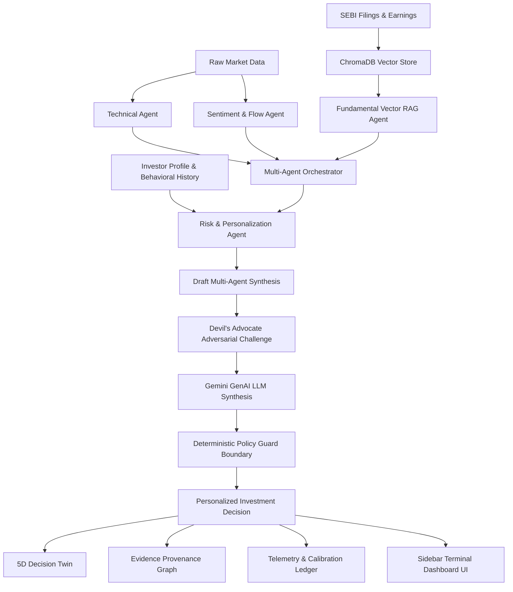
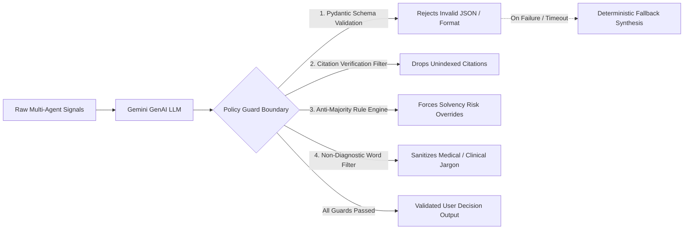

# FinIntelligence AI — Multi-Agent Autonomous Financial Intelligence System for Retail Investors

> **HACKVERSE 2026 — Problem Statement 01 (PS-01)**  
> *Vellore Institute of Technology (VIT) Chennai*

[](tests/test_rag_provenance.py)
[](auth/auth_service.py)
[](agents/fundamental_rag_agent.py)
[](https://www.python.org/)
[](main.py)
[](agents/fundamental_rag_agent.py)
[](agents/orchestrator.py)

---

## 📑 Table of Contents

1. [Problem Statement & Core Concept](#1-problem-statement--core-concept)
2. [⏱️ 60-Second Evaluator Walkthrough](#2-️-60-second-evaluator-walkthrough)
3. [End-to-End System Architecture](#3-end-to-end-system-architecture)
4. [Multi-Agent System & Core Engines](#4-multi-agent-system--core-engines)
5. [Evidence-Grounded RAG Pipeline & Provenance](#5-evidence-grounded-rag-pipeline--provenance)
6. [Gemini GenAI → Deterministic Policy Guard Boundary](#6-gemini-genai--deterministic-policy-guard-boundary)
7. [Benchmark Demonstration Scenarios](#7-benchmark-demonstration-scenarios)
8. [Authentication Architecture & Multi-User Isolation](#8-authentication-architecture--multi-user-isolation)
9. [Automated Test Suite (56/56 Passing)](#9-automated-test-suite-5656-passing)
10. [Project Directory Structure](#10-project-directory-structure)
11. [Quick Start & Execution](#11-quick-start--execution)
12. [Compliance & Educational Disclaimer](#12-compliance--educational-disclaimer)

---

## 1. Problem Statement & Core Concept

Indian retail investors face an acute dilemma: trading apps reduce financial decision-making to binary buy/sell prompts, while institutional research is buried inside 100-page corporate filings. Retail investors routinely suffer from **cognitive bias traps** (FOMO, momentum chasing, recency bias) and misinterpret raw market momentum as personal financial suitability.

**The Fundamental Principle of FinIntelligence AI**:
$$\text{MARKET VIEW} \neq \text{PERSONALIZED ACTION}$$

A strong market signal must **never** automatically become a `BUY CANDIDATE` for every investor.

| Dimension | Market View | Investor Decision Fit |
| :--- | :--- | :--- |
| **Input Signals** | Technical Momentum, Sentiment, Balance Sheet Health | Risk Tolerance, Portfolio Concentration, Leverage Tolerance |
| **Independence** | **100% Identical** across all personas | **Diverges** strictly per declared investor profile |
| **Example (`XYZ_CORP`)** | `HIGH_RISK_MOMENTUM` (Raw Confidence: 0.65) | Conservative Senior: `AVOID-HIGH RISK` &bull; Aggressive Gen-Z: `HOLD-WATCH (Cap < 5%)` |

---

## 2. ⏱️ 60-Second Evaluator Walkthrough

For hackathon judges and evaluators, experience the core innovations in under one minute:

1. **Instant Sign-In (0–5s)**:
   - Navigate to `http://localhost:8000/`.
   - Click the **`⚡ Instant Demo Access`** button to log in immediately with pre-provisioned demo credentials.

2. **Scenario A — Aligned Expansion (5–20s)**:
   - View `TATAMOTORS`: Technical breakout + positive institutional sentiment + clean balance sheet ($0.62\times$ D/E cited from `[SEBI-Filing-TATAMOTORS-Q3: Page 12]`).
   - Observe the **Two-Track Confidence Split**: Market Confidence ($85\%$) alongside Investor Decision Fit ($88\%$).

3. **Scenario B — Anti-Majority Conflict Resolution (20–35s)**:
   - Click `Scenario B (Conflict: XYZ)` or switch active ticker to `XYZ_CORP`.
   - Observe that despite strong bullish momentum and positive chatter, the system **rejects a majority-voting trap**, extracts the $3.85\times$ debt breach from `[SEBI-Filing-XYZ-Q3: Page 14]`, and triggers a **High-Severity Devil's Advocate Challenge**.

4. **Persona Divergence (35–45s)**:
   - Switch Investor Persona to **Aggressive Gen-Z**:
   - Notice that the **Market View remains 100% identical** (`HIGH_RISK_MOMENTUM`), but the **Personalized Advice adapts safely** from `AVOID-HIGH RISK` to `HOLD-WATCH (Cap < 5%)`.

5. **AI Copilot & Audit Provenance (45–60s)**:
   - Click the floating **AI Assistant** button in the bottom right and ask: *"What is the debt to equity ratio disclosed for XYZ Corp?"*
   - Observe the real-time ChromaDB RAG vector response with exact page citations and provenance.

---

## 3. End-to-End System Architecture



---

## 4. Multi-Agent System & Core Engines

### 4.1. Technical Analysis Agent (`agents/technical_agent.py`)
- Calculates 14-period RSI, MACD signal crossover, 10-day rate of change (momentum), and volume anomaly z-scores over rolling 20-day distributions.
- Calibrated to realistic market series ($RSI \in [45, 80]$).
- Output: `TechnicalSignal` with strict mathematical attributions.

### 4.2. Fundamental Vector RAG Agent (`agents/fundamental_rag_agent.py`)
- ChromaDB collection query with cosine semantic embeddings and metadata filtering (`where={"ticker": ticker}`).
- Strict chunk citation tagging (e.g. `[SEBI-Filing-XYZ-Q3: Page 14]`).
- **Null-Safe Solvency Evaluation**: Missing filings or missing debt are represented as `None` / `data_available=False`, never coerced to `0.0x`.
- Filing freshness detector flags documents $> 12$ months old.
- **Zero Hardcoded Truth**: All metrics and verdicts originate from retrieved evidence chunks with complete provenance objects.

### 4.3. Sentiment & Flow Agent (`agents/sentiment_agent.py`)
- Separates Foreign Institutional Investors (`fii_flow: INFLOW / OUTFLOW / NEUTRAL`) and Domestic Institutions (`dii_flow: INFLOW / OUTFLOW / NEUTRAL`).
- Scans news headline sentiment scores and social chatter participation intensity.

### 4.4. Risk & Personalization Agent (`agents/risk_agent.py`)
- Single-stock concentration ceilings (e.g. 15% max allocation).
- Sector exposure aggregation (e.g., Automobile, IT, Infrastructure).
- Persona debt penalties & volatility tolerance constraints.

### 4.5. Devil's Advocate Adversarial Agent (`agents/devils_advocate_agent.py`)
- Adversarial challenge pass that actively modifies confidence and recommendation.
- Strictly constrained to re-weighing existing retrieved citations; **never fabricates evidence**.

### 4.6. Behavioral Bias Mirror & Drift Engine (`profiling/`)
- Detects non-clinical behavioral biases: `MOMENTUM_CHASING`, `RECENCY_BIAS`, `FAMILIARITY_CONCENTRATION`.
- Provides protective behavioral nudges without diagnostic jargon.

### 4.7. Five-Dimension Decision Twin (`engine/decision_twin.py`)
Five separately scored dimensions evaluated side by side — **never averaged into a single collapsed score**:
1. **Market Confidence** (Signal agreement)
2. **Investor Decision Fit** (Mandate suitability)
3. **Evidence Quality** (Filing freshness & citations)
4. **Thesis Health** (Stated assumption validity)
5. **Behavioral Risk** (FOMO / drift intensity)

### 4.8. Confidence Decomposition Engine (`utils/metrics.py`)
$$\text{Composite Confidence} = 0.25 \cdot \text{Freshness} + 0.35 \cdot \text{Agreement} + 0.25 \cdot \text{Evidence} + 0.15 \cdot \text{Calibration}$$
$$\sum w_i = 1.000$$

### 4.9. AI Copilot Research Assistant (`main.py` - `/api/copilot/query`)
- Interactive evidence-grounded chatbot embedded directly on the dashboard.
- Queries ChromaDB vector database in real-time to answer investor queries with exact citation provenance and page-level references.

---

## 5. Evidence-Grounded RAG Pipeline & Provenance

```
SEBI Filing / Earnings Document
  ↓
Document Chunking & Metadata Parsing (Page numbers, citation tags)
  ↓
ChromaDB Vector Store (Cosine semantic embeddings)
  ↓
Semantic Vector Retrieval (Ticker used strictly for document filtering)
  ↓
Evidence Extraction (Regex & metadata extraction directly on retrieved text)
  ↓
Financial Metric & Provenance Object (value, citation, page, document_id, snippet)
  ↓
FundamentalSignal (Evidence-grounded verdict derivation)
```

### Provenance Structure Example:
```json
{
  "debt_to_equity": {
    "value": 3.85,
    "citation": "[SEBI-Filing-XYZ-Q3: Page 14]",
    "page": 14,
    "document_id": "SEBI-Filing-XYZ-Q3-2026",
    "source_file": "XYZ_CORP_sebi_filing.txt",
    "evidence_snippet": "The resulting debt-to-equity ratio has expanded to 3.85x, significantly breaching statutory covenants..."
  }
}
```

---

## 6. Gemini GenAI → Deterministic Policy Guard Boundary

To prevent LLM hallucination and ensure absolute adherence to retail investor protection rules, GenAI model outputs (Google Gemini) are **never trusted unconditionally**. Every LLM generation must pass through a strict four-stage **Deterministic Policy Guard Boundary**:



1. **Pydantic Type Guard**: Strictly enforces the `SynthesizedOutput` schema. If the response contains malformed JSON or invalid types, the system instantly switches to deterministic mathematical synthesis.
2. **Citation Provenance Guard**: Verifies that every source attribution in `source_attributions` exists verbatim in the retrieved ChromaDB vector chunks. Fabricated citation tags are rejected.
3. **Anti-Majority Rule Engine**: If the Fundamental RAG Agent detects `CRITICAL_RISK` (e.g. debt $> 2.5\times$), the Policy Guard overrides any positive LLM output to guarantee an `AVOID` or `HOLD-WATCH` constraint.
4. **Behavioral Language Guard (`utils/security.py`)**: Filters out diagnostic psychiatric terminology to ensure communications remain purely objective financial nudges.
5. **Deterministic Fallback**: In offline, rate-limited, or mock modes, the system runs with zero external API dependencies, producing identical verifiable outputs.

---

## 7. Benchmark Demonstration Scenarios

> **Data Provenance Clarification**: All scenario price series, order volumes, and corporate disclosures are simulated benchmark datasets (`data/corporate_filings/`) created specifically for the HACKVERSE 2026 educational evaluation.

| Scenario | Ticker | Market Setup | Conservative Senior | Aggressive Gen-Z | Anti-Majority Resolution |
| :--- | :--- | :--- | :--- | :--- | :--- |
| **A: Aligned Bullish** | `TATAMOTORS` | Tech Bullish + Sent Positive + Clean Balance Sheet | `BUY CANDIDATE` (Cap 15%) | `BUY CANDIDATE` (Growth) | Aligned multi-agent expansion |
| **B: Conflict Resolution** | `XYZ_CORP` | Tech Bullish + Sent Positive + Debt/Equity 3.85x | `AVOID-HIGH RISK` | `HOLD-WATCH` (Cap 5%) | **Anti-Majority Vote**: Rejects false consensus |
| **C: Degraded Data** | `INFOSYS` | Simulated missing filing feed | `HOLD-WATCH` (Insufficient Evid.) | `HOLD-WATCH` (Insufficient Evid.) | Graceful fallback, no hallucination |
| **D: Lead Demo (Stale + Drift)**| `XYZ_CORP` | Stale filing (19 mo) + FOMO spike + DA challenge | `AVOID-HIGH RISK` | `HOLD-WATCH` | Stale warning + Bias nudge |

---

## 8. Authentication Architecture & Multi-User Isolation

The application features a decoupled, zero-trust session authentication layer designed with production-style security patterns:

- **Password Security**: Argon2id password hashing (`argon2-cffi`) with unique per-user salts. Passwords are never stored, logged, or returned in plaintext.
- **Session Security**: Cryptographically signed JSON Web Tokens (`PyJWT`, `HS256`) with a 60-minute expiration.
- **Multi-User Isolation**: User identity (`current_user.id`) is extracted strictly from the validated Bearer token. Alice cannot view or mutate Bob's private investment theses, session evidence graphs, or risk preferences.
- **Brute Force Defense**: In-memory rate limiting locks accounts for 5 minutes after 5 consecutive failed attempts (`HTTP 429 Too Many Requests`).
- **Security Headers**: Injected OWASP security headers (`X-Content-Type-Options: nosniff`, `X-Frame-Options: DENY`, `Referrer-Policy: no-referrer`).

### Authentication API Endpoints:
| Method | Route | Auth Required | Description |
| :--- | :--- | :---: | :--- |
| `POST` | `/auth/register` | No | Register investor account (`email` + min 8-char `password`) |
| `POST` | `/auth/login` | No | Authenticate & receive Bearer JWT access token |
| `POST` | `/auth/logout` | **Yes** | Invalidate client session token |
| `GET` | `/auth/me` | **Yes** | Retrieve active user identity and profile metadata |
| `GET` | `/api/profile` | **Yes** | Fetch authenticated user risk profile & concentration limits |
| `PUT` | `/api/profile` | **Yes** | Update authenticated user risk preferences |

---

## 9. Automated Test Suite (56/56 Passing)

```bash
python -m pytest -v tests/
```

```
============================= test session starts =============================
platform win32 -- Python 3.11.9, pytest-9.1.1, pluggy-1.6.0
collected 56 items

tests/test_auth.py::test_1_successful_registration PASSED                [  1%]
tests/test_auth.py::test_2_duplicate_registration_returns_409 PASSED     [  3%]
tests/test_auth.py::test_3_weak_password_rejected PASSED                 [  5%]
tests/test_auth.py::test_4_successful_login PASSED                       [  7%]
tests/test_auth.py::test_5_invalid_password_returns_401 PASSED           [  8%]
tests/test_auth.py::test_6_invalid_email_format PASSED                   [ 10%]
tests/test_auth.py::test_7_missing_token_returns_401 PASSED              [ 12%]
tests/test_auth.py::test_8_invalid_token_returns_401 PASSED              [ 14%]
tests/test_auth.py::test_9_expired_token_returns_401 PASSED              [ 16%]
tests/test_auth.py::test_10_auth_me_returns_identity PASSED              [ 17%]
tests/test_auth.py::test_11_analyze_endpoint_with_auth PASSED            [ 19%]
tests/test_auth.py::test_12_user_profile_crud_and_isolation PASSED       [ 21%]
tests/test_auth.py::test_13_multi_user_thesis_isolation PASSED           [ 23%]
tests/test_auth.py::test_14_multi_user_session_isolation PASSED          [ 25%]
tests/test_auth.py::test_15_brute_force_rate_limiting PASSED             [ 26%]
tests/test_auth.py::test_16_security_headers PASSED                      [ 28%]
tests/test_rag_provenance.py::test_1_xyz_debt_value_provenance PASSED    [ 30%]
tests/test_rag_provenance.py::test_2_citation_comes_from_retrieved_evidence PASSED [ 32%]
tests/test_rag_provenance.py::test_3_missing_filing_produces_unknown_and_null PASSED [ 33%]
tests/test_rag_provenance.py::test_4_missing_evidence_never_becomes_zero PASSED [ 35%]
tests/test_rag_provenance.py::test_5_no_ticker_specific_financial_assignments_in_source PASSED [ 37%]
tests/test_rag_provenance.py::test_6_scenario_b_detects_xyz_debt_warning PASSED [ 39%]
tests/test_rag_provenance.py::test_7_scenario_c_degraded_mode PASSED     [ 41%]
tests/test_rag_provenance.py::test_8_tata_and_infosys_provenance PASSED   [ 42%]
tests/test_system.py::test_1_technical_calculations PASSED               [ 44%]
tests/test_system.py::test_2_rag_retrieves_xyz_debt_evidence PASSED      [ 46%]
tests/test_system.py::test_3_parallel_agents_concurrency PASSED          [ 48%]
tests/test_system.py::test_4_divergent_persona_advice PASSED             [ 50%]
tests/test_system.py::test_5_conflict_resolution_no_majority_vote PASSED [ 51%]
tests/test_system.py::test_6_missing_filing_resilience PASSED            [ 53%]
tests/test_system.py::test_7_gemini_failure_fallback PASSED              [ 55%]
tests/test_system.py::test_8_invalid_ticker_validation PASSED            [ 57%]
tests/test_system.py::test_9_invalid_persona_validation PASSED           [ 58%]
tests/test_system.py::test_10_no_api_key_required_in_mock_mode PASSED    [ 60%]
tests/test_system.py::test_11_fundamental_recommendation_citations PASSED [ 62%]
tests/test_system.py::test_12_degraded_mode_confidence_reduction PASSED  [ 64%]
tests/test_system.py::test_13_devils_advocate_evidence_constrained PASSED [ 66%]
tests/test_system.py::test_14_confidence_breakdown_bounded_and_consistent PASSED [ 67%]
tests/test_system.py::test_15_stale_filing_detection PASSED              [ 69%]
tests/test_system.py::test_16_behavioral_bias_flags_and_control PASSED   [ 71%]
tests/test_system.py::test_17_decision_twin_five_scores_independent PASSED [ 73%]
tests/test_system.py::test_18_thesis_break_requires_citation_evidence PASSED [ 75%]
tests/test_system.py::test_19_counterfactual_simulator_disclaimer_and_assumptions PASSED [ 76%]
tests/test_system.py::test_20_evidence_graph_claim_resolution PASSED     [ 78%]
tests/test_system.py::test_21_what_changed_empty_on_no_changes PASSED    [ 80%]
tests/test_system.py::test_22_behavioral_drift_no_diagnostic_terms PASSED [ 82%]
tests/test_system.py::test_23_copilot_endpoint_grounded_answer PASSED    [ 83%]
tests/test_system.py::test_24_market_view_vs_investor_fit_separation PASSED [ 85%]
tests/test_system.py::test_25_separate_fii_dii_flows PASSED              [ 87%]
tests/test_system.py::test_26_missing_debt_data_is_none PASSED           [ 89%]
tests/test_system.py::test_27_citation_integrity_no_hallucinations PASSED [ 91%]
tests/test_system.py::test_28_api_stocks_and_personas PASSED             [ 92%]
tests/test_system.py::test_29_demo_scenarios_and_calibration PASSED      [ 94%]
tests/test_system.py::test_30_health_check_endpoint PASSED               [ 96%]
tests/test_system.py::test_31_thesis_endpoints_save_and_retrieve PASSED  [ 98%]
tests/test_system.py::test_32_simulation_endpoint PASSED                 [100%]

============================= 56 passed in 15.19s =============================
```

---

## 10. Project Directory Structure

```
finintel-decision-engine/
├── agents/
│   ├── counterfactual_simulator.py  # Scenario & shock simulation
│   ├── devils_advocate_agent.py     # Adversarial stress tester
│   ├── fundamental_rag_agent.py     # ChromaDB vector RAG with provenance
│   ├── orchestrator.py              # Parallel execution & synthesis pipeline
│   ├── risk_agent.py                # Investor personalization & risk limits
│   ├── sentiment_agent.py           # FII/DII flow separation & news sentiment
│   ├── technical_agent.py           # RSI, MACD, momentum & volume anomalies
│   └── thesis_break_agent.py        # Thesis invalidation monitoring
├── auth/
│   ├── auth_service.py              # Argon2 password hasher & PyJWT manager
│   ├── database.py                  # SQLite isolated tables for users & theses
│   ├── dependencies.py              # FastAPI Bearer auth dependencies
│   └── models.py                    # Pydantic schemas for auth & profiles
├── data/
│   └── corporate_filings/           # Indexed SEBI disclosures & earnings excerpts
├── engine/
│   ├── change_digest.py             # What-changed snapshot delta engine
│   ├── decision_twin.py             # 5-Dimensional independent Decision Twin
│   └── evidence_graph.py            # Node-link provenance graph constructor
├── logs/
│   ├── calibration_ledger.py        # Brier calibration score tracker
│   ├── decision_audit_trail.jsonl   # Append-only decision audit ledger
│   └── session_logger.py            # Session telemetry & user ownership logger
├── profiling/
│   ├── behavioral_bias_mirror.py    # Non-diagnostic bias flag detector
│   ├── behavioral_drift.py          # Long-term behavioral drift monitor
│   └── user_profile.py              # Investor persona definitions
├── static/
│   └── index.html                   # High-density Terminal UI + Auth Gate
├── tests/
│   ├── test_auth.py                 # 16 Authentication & isolation tests
│   ├── test_rag_provenance.py       # 8 Pure evidence extraction tests
│   └── test_system.py               # 32 Multi-agent system & scenario tests
├── utils/
│   ├── filing_freshness.py          # 12-month filing staleness monitor
│   ├── metrics.py                   # 4-factor confidence breakdown formula
│   └── security.py                  # Input sanitizer & non-diagnostic filter
├── config.py                        # Centralized system configurations
├── main.py                          # FastAPI application & API router
├── requirements.txt                 # Python dependencies
└── README.md                        # Documentation & verification report
```

---

## 11. Quick Start & Execution

### 1. Installation
```bash
git clone https://github.com/bhuvaneshwarann-ma/finintel-decision-engine.git
cd finintel-decision-engine
pip install -r requirements.txt
```

### 2. Launch FastAPI Server
```bash
python -m uvicorn main:app --host 127.0.0.1 --port 8000 --reload
```

### 3. Open Terminal Dashboard
- **Dashboard UI**: `http://localhost:8000/` (or `/dashboard`)
- **Interactive Physics View**: `http://localhost:8000/antigravity`
- **Interactive Swagger API Docs**: `http://localhost:8000/docs`
- **System Health Check**: `http://localhost:8000/health`

### 4. Instant Demo Credentials
Click the **`⚡ Instant Demo Access`** button directly on the login screen, or sign in using:
- **Email**: `investor@example.com`
- **Password**: `DemoPassword123!`

---

## 12. Compliance & Educational Disclaimer

> **RESEARCH & EDUCATIONAL PROTOTYPE ONLY**  
> FinIntelligence AI is developed for academic evaluation at HACKVERSE 2026 (VIT Chennai). It does not provide financial advice, personalized portfolio management, or automated trade execution under SEBI (Investment Advisers) Regulations. All scenarios use simulated demonstration market feeds and indexed filing disclosures.
